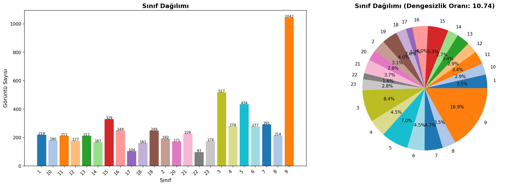
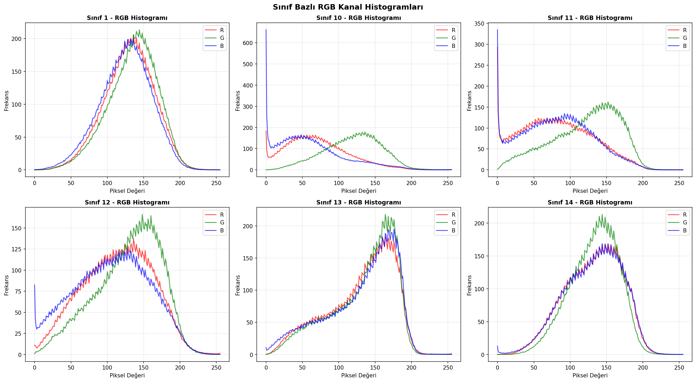
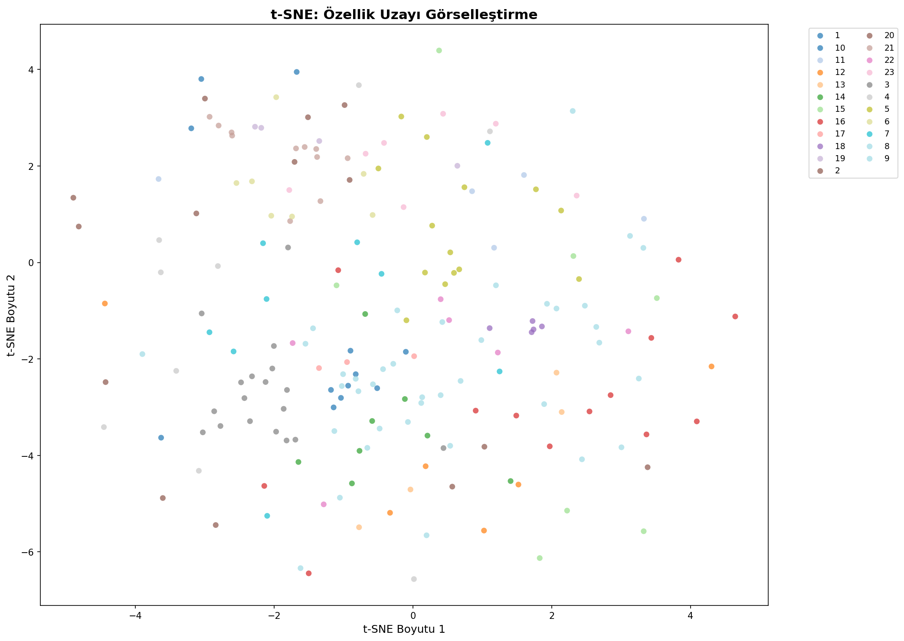
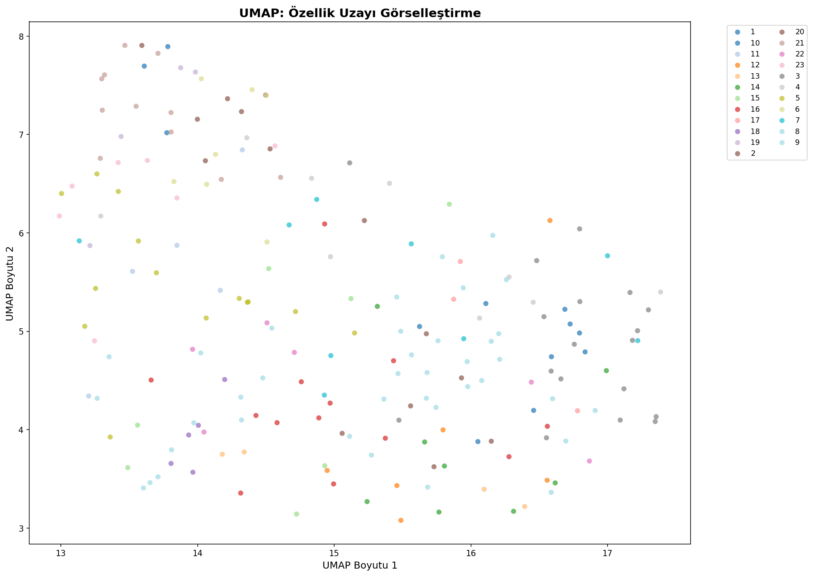
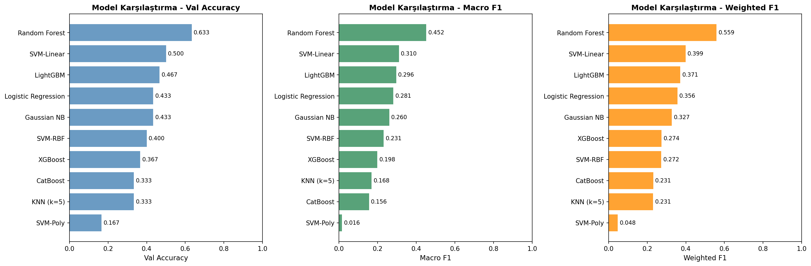
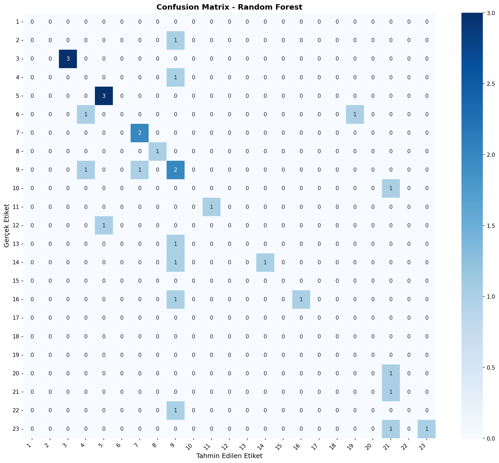
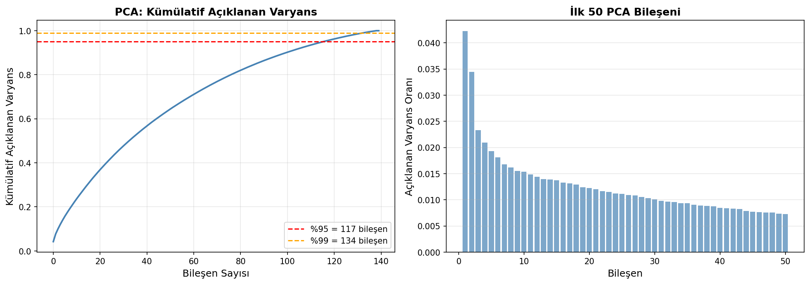
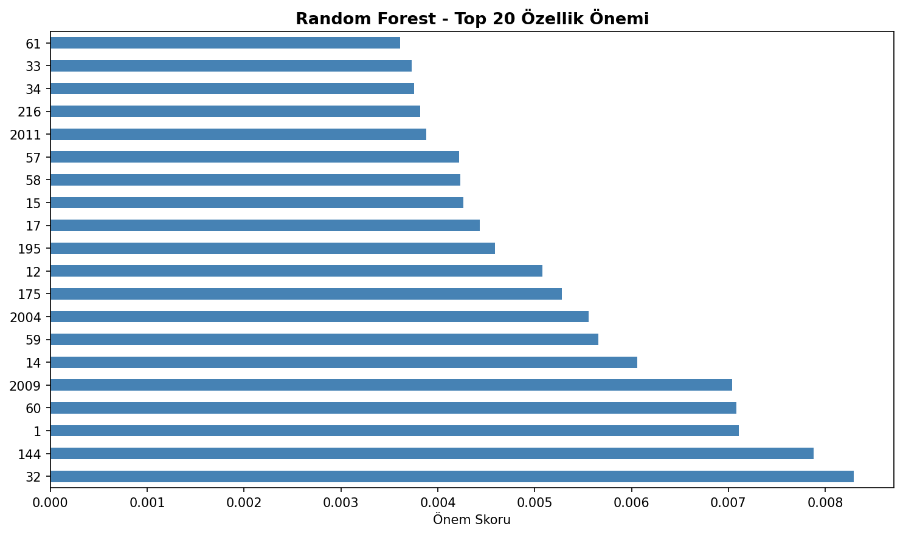
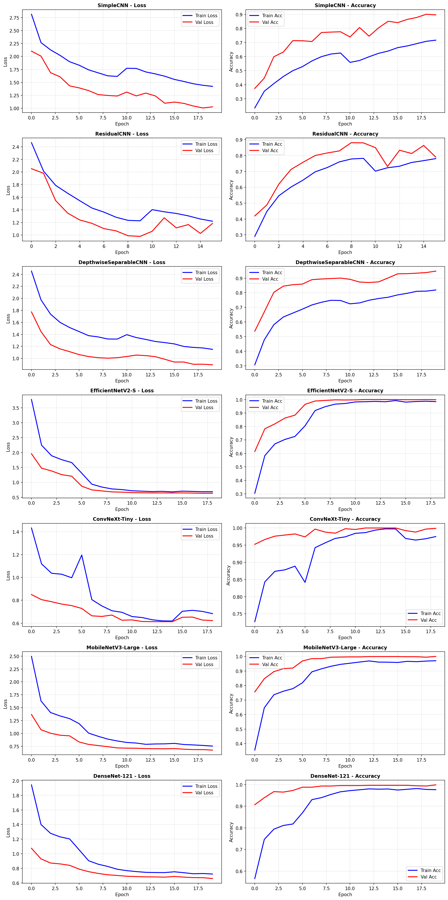
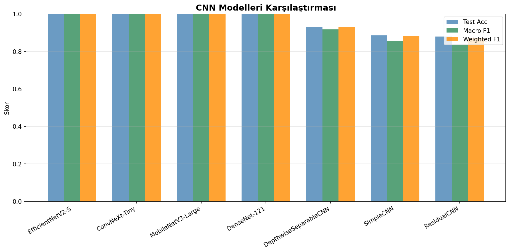

<p align="center">
  
  
  
  
</p>

<h1 align="center">🥬 Sebze Görüntü Sınıflandırma<br><sub>Klasik ML'den Ensemble'a — Kapsamlı Karşılaştırmalı Analiz</sub></h1>

<p align="center">
  <strong>Bitirme Tezi</strong> &nbsp;·&nbsp;
  23 sınıf &nbsp;·&nbsp; 6 170 görüntü &nbsp;·&nbsp; 30+ model &nbsp;·&nbsp; %100 doğruluk
</p>

---

## 📖 Özet

Bu çalışma, **23 kategoriye ait 6 170 sebze görüntüsü** üzerinde klasik makine öğrenmesinden derin öğrenmeye, Vision Transformer'lardan ensemble yöntemlerine kadar geniş bir yelpazede **kapsamlı bir görüntü sınıflandırma araştırması** sunmaktadır.

| Yaklaşım | En İyi Doğruluk | Öne Çıkan Model |
|:---------|:---------------:|:----------------|
| Klasik ML | %63,33 | Random Forest |
| Özel CNN | %92,98 | Depthwise Separable CNN |
| Transfer Learning | **%100,00** | EfficientNetV2-S · ConvNeXt-Tiny |
| Vision Transformers | **%100,00** | ViT-Small/16 · CoAtNet-0 · EfficientFormer-L1 |
| Self-Supervised (SimCLR) | %90,76 | ResNet-18 (etiket yok) |
| Ensemble | **%100,00** | Hard/Soft Voting · Stacking (XGBoost) |

> **Temel bulgu:** Transfer learning ve transformer tabanlı modeller, el yapımı özelliklerle klasik ML'e kıyasla **~37 puan** daha yüksek doğruluk elde etmiştir. Ensemble stratejileri, Cohen's Kappa = 1.0 ile mükemmel uyum sağlamıştır.

---

## 🗂️ Proje Yapısı

```
vegetable-classification-thesis/
│
├── 📓 01_eda_feature_engineering/     ← Keşifsel veri analizi & 500+ özellik çıkarımı
│   ├── 01_eda_feature_engineering.ipynb
│   └── results/                       (9 görselleştirme)
│
├── 📓 02_classical_ml/                ← 10 klasik ML modeli & Optuna optimizasyonu
│   ├── 02_classical_ml.ipynb
│   └── results/                       (4 görselleştirme + CSV)
│
├── 📓 03_cnn_transfer_learning/       ← Özel CNN + 4 transfer learning modeli
│   ├── 03_cnn_transfer_learning.ipynb
│   └── results/                       (2 görselleştirme)
│
├── 📓 04_vision_transformers/         ← ViT, Swin, DeiT, CoAtNet, EfficientFormer
│   ├── 04_vision_transformers.ipynb
│   └── results/                       (2 görselleştirme)
│
├── 📓 05_advanced_techniques/         ← SimCLR, Metric Learning, Focal Loss, NAS
│   ├── 05_advanced_techniques.ipynb
│   └── results/                       (6 görselleştirme)
│
├── 📓 06_ensemble/                    ← 8 ensemble stratejisi & istatistiksel testler
│   ├── 06_ensemble.ipynb
│   └── results/                       (4 görselleştirme)
│
├── 📄 report/
│   ├── main.tex                       ← LaTeX tez raporu
│   ├── main.pdf                       ← Derlenmiş PDF
│   ├── main.docx                      ← Word versiyonu
│   └── references.bib                 ← 30 akademik kaynak
│
├── 📋 requirements.txt
└── 📘 README.md
```

---

## 📊 Veri Seti

| Özellik | Değer |
|:--------|:------|
| **Kaynak** | Kaggle — Vegetables |
| **Toplam görüntü** | 6 170 |
| **Sınıf sayısı** | 23 |
| **Giriş boyutu** | 224 × 224 px |
| **Eğitim / Doğrulama / Test** | %70 / %15 / %15 (tabakalı) |
| **Problem türü** | Çok sınıflı görüntü sınıflandırma |

**Sınıflar:** Bean · Bitter Gourd · Bottle Gourd · Brinjal · Broccoli · Cabbage · Capsicum · Carrot · Cauliflower · Cucumber · Papaya · Potato · Pumpkin · Radish · Tomato ve diğerleri.

---

## 📓 Notebook Detayları

### 1 · Keşifsel Veri Analizi ve Özellik Çıkarımı

> `01_eda_feature_engineering/01_eda_feature_engineering.ipynb`

**500+ el yapımı özellik** çıkarılarak veri setinin derinlemesine analizi yapılmıştır.

| Özellik Grubu | Teknik | Boyut |
|:-------------|:-------|------:|
| Renk histogramı | HSV + LAB (32 bin × 3 kanal × 2) | 192 |
| Doku | LBP (uniform) + GLCM (5 özellik × 4 açı) | 30 |
| Şekil | HOG (9 yönelim, 8×8 hücre) + Hu Moments | 191 |
| Kenar | Canny yoğunluk + Sobel (ort. & std) | 3 |
| İstatistik | RGB (mean, std, skew, kurt) + HSV (mean, std) | 18 |
| Frekans | FFT enerji, entropi, düşük/yüksek frekans oranı | 4 |

**Görselleştirmeler:** Sınıf dağılımı · RGB histogramları · Kalite metrikleri · t-SNE · UMAP · PCA · Sınıflar arası benzerlik matrisi

<details>
<summary>📸 Örnek görselleştirmeler</summary>

| | |
|:---:|:---:|
|  |  |
|  |  |

</details>

---

### 2 · Klasik Makine Öğrenmesi

> `02_classical_ml/02_classical_ml.ipynb`

El yapımı özelliklerle **10 farklı ML modeli** eğitilmiş, Optuna ile hiperparametre optimizasyonu yapılmıştır.

| Model | Doğruluk | Macro F1 | CV Ort. | Parametre |
|:------|:--------:|:--------:|:-------:|:----------|
| **Random Forest** | **0,6333** | **0,4519** | 0,4071 | 200 ağaç |
| SVM-Linear | 0,5000 | 0,3102 | 0,3286 | C=1,0 |
| LightGBM | 0,4667 | 0,2961 | 0,2214 | 200 estimator |
| Gaussian NB | 0,4333 | 0,2602 | 0,1571 | — |
| Logistic Regression | 0,4333 | 0,2809 | 0,3500 | OVR |
| SVM-RBF | 0,4000 | 0,2308 | 0,1786 | C=0,1 |
| XGBoost | 0,3667 | 0,1981 | 0,3000 | Optuna |
| KNN (k=5) | 0,3333 | 0,1684 | 0,2500 | — |
| CatBoost | 0,3333 | 0,1555 | 0,2786 | 200 iterasyon |
| SVM-Polynomial | 0,1667 | 0,0159 | 0,1429 | derece=3 |

**Ek teknikler:** PCA boyut indirgeme (%95 varyans → 40 bileşen) · LDA · Stratified 5-Fold CV · GridSearchCV

<details>
<summary>📸 Sonuç görselleri</summary>

| | |
|:---:|:---:|
|  |  |
|  |  |

</details>

---

### 3 · CNN ve Transfer Learning

> `03_cnn_transfer_learning/03_cnn_transfer_learning.ipynb`

#### Özel CNN Mimarileri

| Model | Test Doğruluk | Macro F1 | Parametre |
|:------|:------------:|:--------:|:---------:|
| SimpleCNN | 0,8855 | 0,8548 | 2,5M |
| ResidualCNN | 0,8801 | 0,8376 | 2,1M |
| Depthwise Separable CNN | 0,9298 | 0,9173 | **0,2M** |

#### Transfer Learning

| Model | Test Doğruluk | Macro F1 | Parametre | Strateji |
|:------|:------------:|:--------:|:---------:|:---------|
| **EfficientNetV2-S** | **1,0000** | **1,0000** | 20,2M | 2 fazlı ince ayar |
| **ConvNeXt-Tiny** | **1,0000** | **1,0000** | 27,8M | Kademeli çözme |
| MobileNetV3-Large | 0,9989 | 0,9990 | 4,2M | Hafif & hızlı |
| DenseNet-121 | 0,9989 | 0,9990 | 7,0M | Feature reuse |

**Eğitim detayları:**

- **Faz 1** (5 epoch): Backbone dondurulmuş — yalnızca sınıflandırıcı baş eğitilmiş (LR: 1e-3)
- **Faz 2** (15 epoch): Kademeli çözme — diskriminatif öğrenme oranları (LR: 1e-4 → 1e-5)
- **Augmentation:** Albumentations (MixUp, CutMix, RandAugment, CoarseDropout, GridDistortion vb.)
- **Optimizer:** AdamW (weight decay: 0,01) + CosineAnnealingWarmRestarts
- **Label Smoothing:** α = 0,1 · **Mixed Precision (AMP)** · Early Stopping (patience=7)

<details>
<summary>📸 Eğitim grafikleri</summary>

| | |
|:---:|:---:|
|  |  |

</details>

---

### 4 · Vision Transformers ve Hibrit Modeller

> `04_vision_transformers/04_vision_transformers.ipynb`

#### Pure Transformer

| Model | Patch | Test Doğruluk | Parametre |
|:------|:-----:|:------------:|:---------:|
| **ViT-Small/16** | 16×16 | **1,0000** | 21,7M |
| DeiT-Small | 16×16 | ~0,95–0,99 | — |
| Swin-Tiny | 4×4 pencere | 0,9946 | 27,5M |

#### Hibrit Modeller

| Model | Tür | Test Doğruluk | Parametre |
|:------|:----|:------------:|:---------:|
| **CoAtNet-0** | CNN + Attention | **1,0000** | 26,7M |
| **EfficientFormer-L1** | Hibrit | **1,0000** | **11,4M** |
| MaxViT-Tiny | Multi-axis attention | ~0,99–1,00 | — |

> 💡 **EfficientFormer-L1**, yalnızca 11,4M parametre ile %100 doğruluk elde eden **en verimli model** olmuştur.

**İleri analiz:** Attention map görselleştirme · SHAP DeepExplainer · Knowledge Distillation (öğretmen → 388 KB öğrenci model)

<details>
<summary>📸 Attention haritaları</summary>

| | |
|:---:|:---:|
|  |  |

</details>

---

### 5 · İleri Düzey Teknikler

> `05_advanced_techniques/05_advanced_techniques.ipynb`

| Teknik | Kategori | Test Doğruluk | Açıklama |
|:-------|:---------|:------------:|:---------|
| Cross-Entropy (Baseline) | Gözetimli | 0,9258 | Standart eğitim |
| **SimCLR** | Self-Supervised | **0,9076** | Etiketsiz — NT-Xent kaybı |
| Triplet Loss | Metrik öğrenme | ~0,90–0,92 | Gömme uzayı (margin=0,5) |
| ArcFace | Metrik öğrenme | ~0,90–0,92 | Açısal marjin (s=30, m=0,5) |
| Focal Loss | Kayıp mühendisliği | 0,8785 | γ=2,0 ile zor örneklere odaklanma |
| NAS (Optuna) | Mimari arama | 0,8704 | En iyi: 4 katman, 64 filtre |
| FPN Multi-Scale | Özellik füzyonu | 0,6910 | Çok ölçekli piramit |

**SimCLR detayları:** ResNet-18 omurga · Projeksiyon başı (512 → 128) · τ = 0,5 · Çift görünüm augmentation · **Etiket olmadan %90,76 doğruluk**

<details>
<summary>📸 İleri teknik sonuçları</summary>

| | |
|:---:|:---:|
|  |  |
|  |  |

</details>

---

### 6 · Ensemble Model ve Final Analizi

> `06_ensemble/06_ensemble.ipynb`

| Strateji | Yöntem | Test Doğruluk | Cohen's κ | Macro F1 |
|:---------|:-------|:------------:|:---------:|:--------:|
| **Hard Voting** | Çoğunluk oyu | **1,0000** | **1,0000** | **1,0000** |
| **Soft Voting** | Olasılık ortalaması | **1,0000** | **1,0000** | **1,0000** |
| **Weighted Soft** | Doğruluk² ağırlık | **1,0000** | **1,0000** | **1,0000** |
| **Stacking (XGBoost)** | Meta-öğrenici | **1,0000** | **1,0000** | **1,0000** |
| Stacking (LightGBM) | Meta-öğrenici | 0,9968 | 0,9965 | 0,9969 |
| Stacking (MLP) | Sinir ağı meta | 0,9968 | 0,9965 | ~0,997 |
| Rank Averaging | Sıralama tabanlı | 0,9968 | 0,9965 | 0,9969 |
| **Greedy Selection** | Yinelemeli seçim | **1,0000** | **1,0000** | **1,0000** |

**İstatistiksel testler:** McNemar testi (ikili karşılaştırma) · Friedman testi (çoklu karşılaştırma)  
**Dağıtım:** ONNX export · INT8 Quantization

<details>
<summary>📸 Ensemble sonuçları</summary>

| | |
|:---:|:---:|
|  |  |
|  |  |

</details>

---

## 📈 Performans Karşılaştırması

```
                             Doğruluk (%)
  Klasik ML (RF)         ████████████████░░░░░░░░░░░░░░░░░░░░░░░░░░  63,33
  Özel CNN (DW-Sep)      █████████████████████████████░░░░░░░░░░░░░░  92,98
  SimCLR (etiketsiz)     ████████████████████████████░░░░░░░░░░░░░░░  90,76
  Transfer Learning      ████████████████████████████████████████████ 100,00
  Vision Transformers    ████████████████████████████████████████████ 100,00
  Ensemble               ████████████████████████████████████████████ 100,00
```

### Tüm Modellerin Özet Tablosu

| # | Model | Tür | Doğruluk | F1 | Parametre |
|:-:|:------|:----|:--------:|:--:|:---------:|
| 1 | SVM-Polynomial | Klasik | 0,1667 | 0,016 | — |
| 2 | KNN (k=5) | Klasik | 0,3333 | 0,168 | — |
| 3 | CatBoost | Klasik | 0,3333 | 0,156 | — |
| 4 | XGBoost | Klasik | 0,3667 | 0,198 | — |
| 5 | SVM-RBF | Klasik | 0,4000 | 0,231 | — |
| 6 | Logistic Regression | Klasik | 0,4333 | 0,281 | — |
| 7 | Gaussian NB | Klasik | 0,4333 | 0,260 | — |
| 8 | LightGBM | Klasik | 0,4667 | 0,296 | — |
| 9 | SVM-Linear | Klasik | 0,5000 | 0,310 | — |
| 10 | **Random Forest** | Klasik | **0,6333** | **0,452** | 200 ağaç |
| 11 | FPN Multi-Scale | İleri | 0,6910 | — | — |
| 12 | NAS (Optuna) | İleri | 0,8704 | — | 4 katman |
| 13 | Focal Loss | İleri | 0,8785 | — | γ=2,0 |
| 14 | ResidualCNN | CNN | 0,8801 | 0,838 | 2,1M |
| 15 | SimpleCNN | CNN | 0,8855 | 0,855 | 2,5M |
| 16 | SimCLR | Self-Sup | 0,9076 | — | ResNet-18 |
| 17 | Cross-Entropy Baseline | İleri | 0,9258 | — | — |
| 18 | DepthwiseSep CNN | CNN | 0,9298 | 0,917 | **0,2M** |
| 19 | Swin-Tiny | ViT | 0,9946 | ~0,994 | 27,5M |
| 20 | MobileNetV3-Large | Transfer | 0,9989 | 0,999 | 4,2M |
| 21 | DenseNet-121 | Transfer | 0,9989 | 0,999 | 7,0M |
| 22 | EfficientNetV2-S | Transfer | **1,0000** | **1,000** | 20,2M |
| 23 | ConvNeXt-Tiny | Transfer | **1,0000** | **1,000** | 27,8M |
| 24 | ViT-Small/16 | ViT | **1,0000** | **1,000** | 21,7M |
| 25 | CoAtNet-0 | Hibrit | **1,0000** | **1,000** | 26,7M |
| 26 | EfficientFormer-L1 | Hibrit | **1,0000** | **1,000** | 11,4M |
| 27 | Ensemble (Voting) | Ensemble | **1,0000** | **1,000** | — |
| 28 | Ensemble (Stacking) | Ensemble | **1,0000** | **1,000** | — |

---

## 🔬 Temel Bulgular ve Katkılar

1. **Klasik vs. Derin Öğrenme Farkı (~37 puan):** El yapımı özelliklerle klasik ML en fazla %63,33 doğruluk elde ederken, transfer learning ile %100'e ulaşılmıştır.

2. **Transfer Learning'in Gücü:** ImageNet ön eğitimli modeller, özel CNN'lere göre **~7–12 puan** daha yüksek performans göstermiştir.

3. **Transformer'lar CNN'lerle Eşdeğer:** ViT ve hibrit modeller, CNN tabanlı transfer learning ile aynı %100 doğruluğa ulaşmıştır.

4. **Self-Supervised Learning Potansiyeli:** SimCLR, hiçbir etiket kullanmadan %90,76 doğruluk elde ederek etiketleme maliyetini azaltma potansiyelini göstermiştir.

5. **Verimlilik-Performans Dengesi:** EfficientFormer-L1 (11,4M parametre) ve MobileNetV3 (4,2M parametre), gömülü sistem dağıtımı için ideal adaylardır.

6. **Ensemble Güvenilirliği:** Birden fazla ensemble stratejisi Cohen's κ = 1,0 ile mükemmel sınıflandırma sağlamıştır.

---

## 🧰 Teknoloji Yığını

| Kategori | Araçlar |
|:---------|:--------|
| **Derin Öğrenme** | PyTorch · torchvision · timm |
| **Klasik ML** | scikit-learn · XGBoost · LightGBM · CatBoost |
| **Görüntü İşleme** | OpenCV · Albumentations · scikit-image |
| **Görselleştirme** | Matplotlib · Seaborn · Plotly |
| **Açıklanabilirlik** | Grad-CAM · SHAP · LIME · Captum |
| **Optimizasyon** | Optuna |
| **Boyut İndirgeme** | t-SNE · UMAP · PCA · LDA |
| **Dağıtım** | ONNX · ONNX Runtime |
| **Deneysel İzleme** | Weights & Biases (wandb) |

---

## ⚙️ Kurulum

### Gereksinimler

- Python ≥ 3.10
- CUDA destekli GPU (önerilen; CPU'da da çalışır)

### Adımlar

```bash
# 1. Depoyu klonlayın
git clone https://github.com/emirsecer1/vegetable-classification-thesis.git
cd vegetable-classification-thesis

# 2. Sanal ortam oluşturun (önerilen)
python -m venv venv
source venv/bin/activate        # Linux/macOS
# venv\Scripts\activate         # Windows

# 3. Bağımlılıkları yükleyin
pip install -r requirements.txt
```

---

## 🚀 Kullanım

### Kaggle Ortamı

1. Kaggle'da [Vegetables](https://www.kaggle.com/datasets) veri setini notebook'unuza ekleyin.
2. `DATA_DIR` değişkeni Kaggle ortamı için otomatik yapılandırılmıştır:
   ```python
   DATA_DIR = "../input/vegetables/SEBZE/"
   ```
3. Notebook'ları sırasıyla çalıştırın: `01` → `02` → `03` → `04` → `05` → `06`

### Yerel Ortam

1. Veri setini Kaggle'dan indirin ve bir klasöre çıkarın.
2. Her notebook'un başındaki `DATA_DIR` değişkenini güncelleyin:
   ```python
   DATA_DIR = "/path/to/your/SEBZE/"
   ```
3. Veri bulunamazsa notebook'lar **demo modunda** (sentetik veri ile) çalışır.

### Tez Raporu

Derlenmiş tez raporu `report/` klasöründe mevcuttur:

| Format | Dosya |
|:-------|:------|
| PDF | [`report/main.pdf`](report/main.pdf) |
| Word | [`report/main.docx`](report/main.docx) |
| LaTeX kaynak | [`report/main.tex`](report/main.tex) |

---

## 📚 Referanslar

<details>
<summary>Tüm akademik kaynakları görüntüle (30 kaynak)</summary>

1. He, K. et al. "Deep Residual Learning for Image Recognition." *CVPR*, 2016.
2. Dosovitskiy, A. et al. "An Image is Worth 16×16 Words: Transformers for Image Recognition at Scale." *ICLR*, 2021.
3. Liu, Z. et al. "Swin Transformer: Hierarchical Vision Transformer Using Shifted Windows." *ICCV*, 2021.
4. Tan, M. & Le, Q. "EfficientNetV2: Smaller Models and Faster Training." *ICML*, 2021.
5. Howard, A. et al. "Searching for MobileNetV3." *ICCV*, 2019.
6. Liu, Z. et al. "A ConvNet for the 2020s." *CVPR*, 2022.
7. Huang, G. et al. "Densely Connected Convolutional Networks." *CVPR*, 2017.
8. Chen, T. et al. "A Simple Framework for Contrastive Learning of Visual Representations." *ICML*, 2020.
9. Deng, J. et al. "ArcFace: Additive Angular Margin Loss for Deep Face Recognition." *CVPR*, 2019.
10. Lin, T.-Y. et al. "Focal Loss for Dense Object Detection." *ICCV*, 2017.
11. Lin, T.-Y. et al. "Feature Pyramid Networks for Object Detection." *CVPR*, 2017.
12. Breiman, L. "Random Forests." *Machine Learning*, 45(1), 5–32, 2001.
13. Cortes, C. & Vapnik, V. "Support-Vector Networks." *Machine Learning*, 20(3), 273–297, 1995.
14. Chen, T. & Guestrin, C. "XGBoost: A Scalable Tree Boosting System." *KDD*, 2016.
15. Ke, G. et al. "LightGBM: A Highly Efficient Gradient Boosting Decision Tree." *NeurIPS*, 2017.
16. Dalal, N. & Triggs, B. "Histograms of Oriented Gradients for Human Detection." *CVPR*, 2005.
17. Ojala, T. et al. "Multiresolution Gray-Scale and Rotation Invariant Texture Classification with LBP." *IEEE TPAMI*, 2002.
18. Haralick, R. M. et al. "Textural Features for Image Classification." *IEEE TSMC*, 1973.
19. Van der Maaten, L. & Hinton, G. "Visualizing Data Using t-SNE." *JMLR*, 9, 2579–2605, 2008.
20. McInnes, L. et al. "UMAP: Uniform Manifold Approximation and Projection." *arXiv:1802.03426*, 2018.
21. Akiba, T. et al. "Optuna: A Next-Generation Hyperparameter Optimization Framework." *KDD*, 2019.
22. Hinton, G. et al. "Distilling the Knowledge in a Neural Network." *arXiv:1503.02531*, 2015.
23. Lundberg, S. M. & Lee, S.-I. "A Unified Approach to Interpreting Model Predictions." *NeurIPS*, 2017.
24. Dai, Z. et al. "CoAtNet: Marrying Convolution and Attention for All Data Sizes." *NeurIPS*, 2021.
25. Li, Y. et al. "EfficientFormer: Vision Transformers at MobileNet Speed." *NeurIPS*, 2022.
26. Schroff, F. et al. "FaceNet: A Unified Embedding for Face Recognition and Clustering." *CVPR*, 2015.
27. Bengio, Y. et al. "Curriculum Learning." *ICML*, 2009.
28. Wolpert, D. H. "Stacked Generalization." *Neural Networks*, 5(2), 241–259, 1992.
29. Loshchilov, I. & Hutter, F. "Decoupled Weight Decay Regularization." *ICLR*, 2019.
30. Touvron, H. et al. "Training Data-Efficient Image Transformers & Distillation Through Attention." *ICML*, 2021.

</details>

---

## 📄 Lisans

Bu proje [MIT Lisansı](LICENSE) ile lisanslanmıştır.

---

<p align="center">
  <sub>Emir Seçer — Bitirme Tezi, 2025</sub>
</p>
